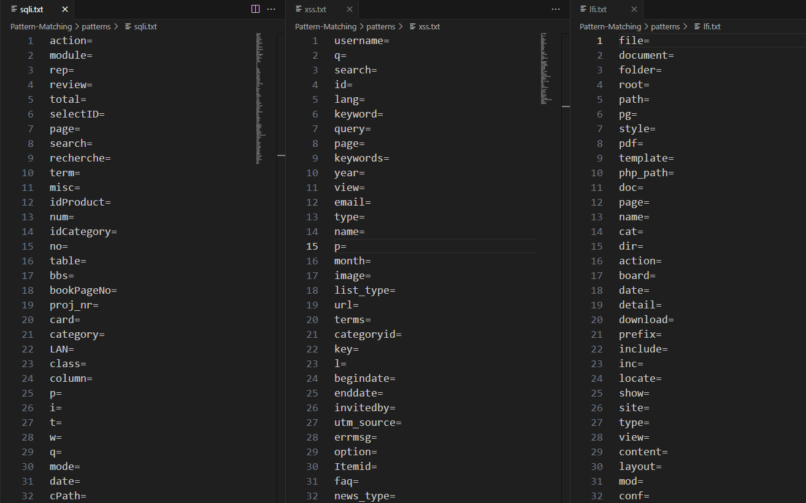

# Pattern-Matching



## Options

```
pm -h

It's an alternative of tomnomnom GF tool

usage: pm [-h] [-f FILE] [-u URL] -p PATTERN [-o OUTPUT] [-r REPLACE] [-i] [-c] [-v]

Match patterns from a file in URLs, append text at each match, or clear parameter values and append text, and print/save modified results.

options:
  -h, --help            show this help message and exit
  -f FILE, --file FILE  File containing URLs (optional, stdin is used if not provided)
  -u URL, --url URL     Single URL to process (optional, overrides -f)
  -p PATTERN, --pattern PATTERN
                        Pattern file to use (e.g., xss.txt)
  -o OUTPUT, --output OUTPUT
                        File to save output results (optional)
  -r REPLACE, --replace REPLACE
                        Text to append after each matched pattern (default: FUZZ)
  -i, --ignore-case     Perform case-insensitive matching with additional logic (default is case-sensitive)
  -c, --clear-values    Remove values of matched parameters but keep parameters and append the -r value
  -v, --version         show program's version number and exit

Examples:
  pm -u "http://example.com" -p /opt/Pattern-Matching/patterns/xss.txt -r "XSS" -o append_text_after_value.txt
  pm -f urls.txt -p /opt/Pattern-Matching/patterns/sqli.txt -r "SQLI" -o append_text_after_value_case_insensitive.txt
  pm -f urls.txt -p /opt/Pattern-Matching/patterns/lfi.txt -c -r "LFI" -o case_insensitive_with_value_replace.txt
  pm -f urls.txt -p /opt/Pattern-Matching/patterns/or.txt -c -i -r "OpenR" -o ignore_case_insensitive_with_value_replace.txt
```

## Usage
```
pm -f params.txt -p /opt/Pattern-Matching/patterns/xss.txt -r "XSS" -o xss_params_output.txt
```

## Piping
```
cat urls.txt | pm -p /opt/Pattern-Matching/patterns/sqli.txt -r "SQLI"
```

## installation

```
cd /opt/
sudo git clone https://github.com/h6nt3r/Pattern-Matching.git
cd
sudo chmod +x /opt/Pattern-Matching/pm.py
sudo ln -sf /opt/Pattern-Matching/pm.py /usr/local/bin/pm
pm -h
```
